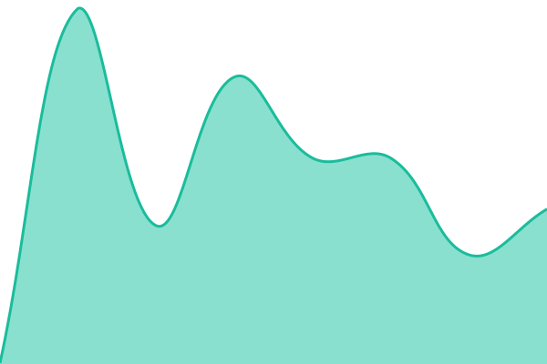
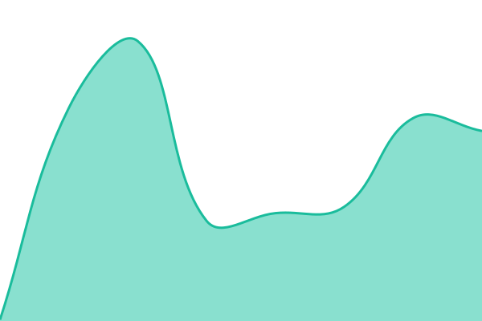

# [📈 Live Status](https://RemyCastle.github.io/status): <!--live status--> **🟩 All systems operational**

This repository contains the open-source uptime monitor and status page for [RemyCastle](https://RemyCastle.github.io/status), powered by [Upptime](https://github.com/upptime/upptime).

With [Upptime](https://upptime.js.org), you can get your own unlimited and free uptime monitor and status page, powered entirely by a GitHub repository. We use [Issues](https://github.com/RemyCastle/status/issues) as incident reports, [Actions](https://github.com/RemyCastle/status/actions) as uptime monitors, and [Pages](https://RemyCastle.github.io/status) for the status page.

<!--start: status pages-->
<!-- This summary is generated by Upptime (https://github.com/upptime/upptime) -->
<!-- Do not edit this manually, your changes will be overwritten -->
<!-- prettier-ignore -->
| URL | Status | History | Response Time | Uptime |
| --- | ------ | ------- | ------------- | ------ |
|  [CuePraxis](https://cuepraxis.onrender.com/login) | 🟩 Up | [cue-praxis.yml](https://github.com/RemyCastle/status/commits/HEAD/history/cue-praxis.yml) | 

 261ms
     
 | 

<a href="https://RemyCastle.github.io/status/history/cue-praxis">100.00%</a>
    

|  [CuePraxis Home](https://cuepraxis.onrender.com/) | 🟩 Up | [cue-praxis-home.yml](https://github.com/RemyCastle/status/commits/HEAD/history/cue-praxis-home.yml) | 

 169ms
     
 | 

<a href="https://RemyCastle.github.io/status/history/cue-praxis-home">100.00%</a>
    

|  [ChairSide](https://chairside-z8vp.onrender.com/) | 🟩 Up | [chair-side.yml](https://github.com/RemyCastle/status/commits/HEAD/history/chair-side.yml) | 

 267ms
     
 | 

<a href="https://RemyCastle.github.io/status/history/chair-side">100.00%</a>
    

|  [ChairSide Demo](https://chairside-z8vp.onrender.com/demo) | 🟩 Up | [chair-side-demo.yml](https://github.com/RemyCastle/status/commits/HEAD/history/chair-side-demo.yml) | 

 164ms
     
 | 

<a href="https://RemyCastle.github.io/status/history/chair-side-demo">100.00%</a>
    

|  [Springfield PBC](https://springfieldpbc.com/) | 🟩 Up | [springfield-pbc.yml](https://github.com/RemyCastle/status/commits/HEAD/history/springfield-pbc.yml) | 

 227ms
     
 | 

<a href="https://RemyCastle.github.io/status/history/springfield-pbc">100.00%</a>
    

|  [Springfield PBC Shop](https://springfieldpbc.com/shop) | 🟩 Up | [springfield-pbc-shop.yml](https://github.com/RemyCastle/status/commits/HEAD/history/springfield-pbc-shop.yml) | 

 123ms
     
 | 

<a href="https://RemyCastle.github.io/status/history/springfield-pbc-shop">100.00%</a>
    

|  [Patriotic Peptides](https://patriotic-peptides.onrender.com/) | 🟩 Up | [patriotic-peptides.yml](https://github.com/RemyCastle/status/commits/HEAD/history/patriotic-peptides.yml) | 

 340ms
     
 | 

<a href="https://RemyCastle.github.io/status/history/patriotic-peptides">100.00%</a>
    

|  [Helix Bio Labs](https://helixbiolabs.spbc.workers.dev/) | 🟩 Up | [helix-bio-labs.yml](https://github.com/RemyCastle/status/commits/HEAD/history/helix-bio-labs.yml) | 

 336ms
     
 | 

<a href="https://RemyCastle.github.io/status/history/helix-bio-labs">100.00%</a>
    

|  [CaseXCase](https://casexcase.onrender.com/) | 🟩 Up | [case-x-case.yml](https://github.com/RemyCastle/status/commits/HEAD/history/case-x-case.yml) | 

 242ms
     
 | 

<a href="https://RemyCastle.github.io/status/history/case-x-case">100.00%</a>
    

|  [Mini-app Demos](https://remy-miniapp-demos.pages.dev/) | 🟩 Up | [mini-app-demos.yml](https://github.com/RemyCastle/status/commits/HEAD/history/mini-app-demos.yml) | 

 127ms
     
 | 

<a href="https://RemyCastle.github.io/status/history/mini-app-demos">100.00%</a>
    

<!--end: status pages-->

[**Visit our status website →**](https://RemyCastle.github.io/status)

## 📄 License

- Powered by: [Upptime](https://github.com/upptime/upptime)
- Code: [MIT](./LICENSE) © [Anand Chowdhary](https://anandchowdhary.com)
- Data in the `./history` directory: [Open Database License](https://opendatacommons.org/licenses/odbl/1-0/)
